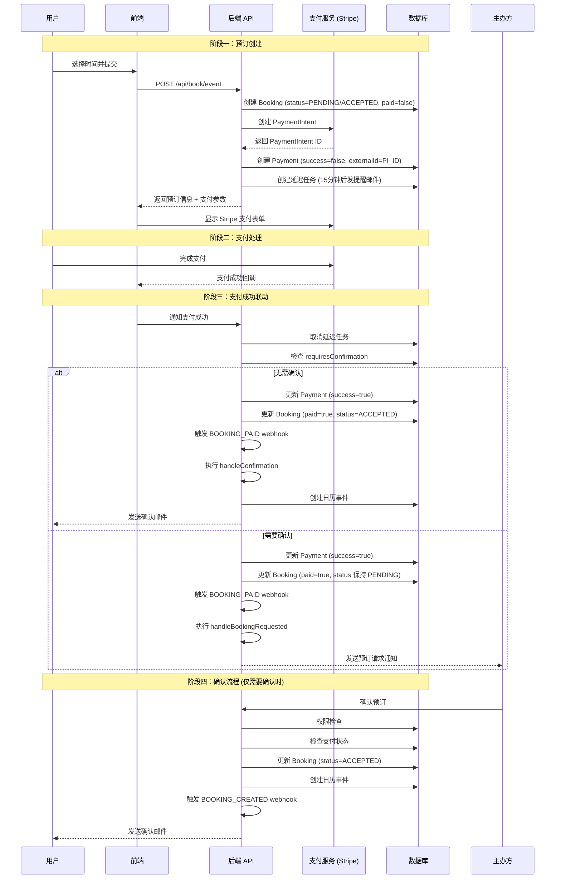

# 付费预约生命周期 (Paid Booking Lifecycle)

本文档详细描述了 Cal.diy 系统中付费预约从下单到确认的完整流程，以及支付状态与预约状态之间的联动机制。

---

## 1. 状态定义

### 1.1 预约状态 (BookingStatus)

定义于 `packages/prisma/schema.prisma:843`

```prisma
enum BookingStatus {
  CANCELLED     @map("cancelled")
  ACCEPTED      @map("accepted")
  REJECTED      @map("rejected")
  PENDING       @map("pending")
  AWAITING_HOST @map("awaiting_host")
}
```

| 状态 | 描述 |
|------|------|
| `PENDING` | 待处理，预订已创建但未确认 |
| `ACCEPTED` | 已接受/确认，预订已生效 |
| `REJECTED` | 已拒绝，预订被主办方拒绝 |
| `CANCELLED` | 已取消，预订被取消 |
| `AWAITING_HOST` | 等待主办方，需主办方确认 |

### 1.2 Booking 模型关键字段

定义于 `packages/prisma/schema.prisma:851`

| 字段 | 类型 | 说明 |
|------|------|------|
| `status` | BookingStatus | 预订状态，默认 `ACCEPTED` |
| `paid` | Boolean | 是否已支付，默认 `false` |
| `payment` | Payment[] | 关联的支付记录 |

### 1.3 支付状态 (Payment Model)

定义于 `packages/prisma/schema.prisma:1095`

```prisma
model Payment {
  id            Int            @id @default(autoincrement())
  uid           String         @unique
  bookingId     Int
  booking       Booking?       @relation(fields: [bookingId], references: [id], onDelete: Cascade)
  amount        Int
  fee           Int
  currency      String
  success       Boolean        # 支付是否成功
  refunded      Boolean        # 是否已退款
  externalId    String         @unique  # 第三方支付平台ID (如 Stripe PaymentIntent ID)
  paymentOption PaymentOption? @default(ON_BOOKING)
}

enum PaymentOption {
  ON_BOOKING  # 预订时立即支付
  HOLD        # 预授权，后续扣款
}
```

---

## 2. 完整流程

### 2.1 流程图概览

```
┌─────────────────┐     ┌─────────────────┐     ┌─────────────────┐
│   1. 预订创建    │────▶│   2. 支付处理    │────▶│  3. 支付成功联动 │
│  (Create Booking)│     │  (Payment Flow)  │     │ (Post-Payment)  │
└─────────────────┘     └─────────────────┘     └────────┬────────┘
                                                           │
                    ┌──────────────────────────────────────┘
                    ▼
           ┌─────────────────┐
           │  4. 确认流程     │
           │ (Confirmation)  │
           └─────────────────┘
```

### 2.2 阶段一：预订创建 (Booking Creation)

**入口文件**: `packages/features/bookings/lib/handleNewBooking/createBooking.ts`

#### 流程步骤：

1. **用户选择付费预约类型**
   - 事件类型 (EventType) 配置了价格 `price > 0`
   - 关联支付应用 (如 Stripe)

2. **构建预订数据** (`buildNewBookingData` 函数)
   ```typescript
   // packages/features/bookings/lib/handleNewBooking/createBooking.ts:183
   const newBookingData: Prisma.BookingCreateInput = {
     status: eventType.isConfirmedByDefault ? BookingStatus.ACCEPTED : BookingStatus.PENDING,
     paid: false,  // 初始为未支付
     // ... 其他字段
   };
   ```

   **关键点**: 初始状态取决于 `eventType.isConfirmedByDefault`
   - `true`: `status = ACCEPTED` (自动确认)
   - `false`: `status = PENDING` (待确认)

3. **创建支付记录** (StripePaymentService)
   
   **入口文件**: `packages/app-store/stripepayment/lib/PaymentService.ts:61`

   ```typescript
   // 创建 Stripe PaymentIntent
   const paymentIntent = await this.stripe.paymentIntents.create(params, {
     stripeAccount: this.credentials.stripe_user_id,
   });

   // 创建本地 Payment 记录
   const paymentData = await prisma.payment.create({
     data: {
       uid: uuidv4(),
       booking: { connect: { id: bookingId } },
       amount: payment.amount,
       currency: payment.currency,
       externalId: paymentIntent.id,  // Stripe PaymentIntent ID
       success: false,                 // 初始为未成功
       refunded: false,
       paymentOption: paymentOption || "ON_BOOKING",
       // ...
     },
   });
   ```

4. **创建等待支付邮件任务**
   
   **入口文件**: `packages/app-store/stripepayment/lib/PaymentService.ts:377`

   ```typescript
   // 创建延迟任务，15分钟后发送等待支付提醒邮件
   await tasker.create(
     "sendAwaitingPaymentEmail",
     { bookingId: booking.id, paymentId: paymentData.id },
     { scheduledAt: dayjs().add(15, "minutes").toDate(), referenceUid: booking.uid }
   );
   ```

#### 此阶段结束状态：
| 字段 | 值 |
|------|-----|
| `booking.status` | `ACCEPTED` 或 `PENDING` |
| `booking.paid` | `false` |
| `payment.success` | `false` |

---

### 2.3 阶段二：支付处理 (Payment Processing)

**支付方式**: Stripe (为主，也支持 PayPal、BTCPayServer、HitPay、Alby 等)

#### 流程步骤：

1. **前端展示支付表单**
   - 文件: `packages/platform/atoms/event-types/payments/StripePaymentForm.tsx`
   - 用户输入支付信息

2. **支付网关流程**
   - 创建 Checkout Session 或 PaymentIntent
   - 用户完成支付

3. **支付成功的感知机制** (关键补充)

系统通过 **Webhook 回调** 感知支付成功，这是支付状态与预订状态联动的**触发入口**。

#### Webhook 架构概览

```
┌─────────────────┐     POST Webhook      ┌─────────────────┐
│  支付网关        │──────────────────────▶│  Cal.diy Webhook │
│  (Stripe/PayPal)│                        │    端点          │
└─────────────────┘                        └────────┬────────┘
                                                      │
                        验证签名 + 查询支付记录        │
                                                      ▼
                                             ┌─────────────────┐
                                             │ handlePayment-  │
                                             │    Success      │
                                             │  (核心联动逻辑)  │
                                             └─────────────────┘
```

#### 各支付网关 Webhook 实现

| 支付网关 | Webhook 文件路径 | 触发事件 |
|---------|------------------|---------|
| PayPal | `packages/app-store/paypal/api/webhook.ts` | `CHECKOUT.ORDER.APPROVED` |
| BTCPayServer | `packages/app-store/btcpayserver/api/webhook.ts` | `InvoiceSettled`, `InvoiceProcessing` |
| HitPay | `packages/app-store/hitpay/api/webhook.ts` | `status: "completed"` |
| Alby | `packages/app-store/alby/api/webhook.ts` | Invoice 支付完成 |
| Stripe (社区版) | `apps/web/pages/api/integrations/stripepayment/webhook.ts` | **不可用** (返回 404) |

#### Webhook 处理流程详解 (以 PayPal 为例)

**文件**: `packages/app-store/paypal/api/webhook.ts`

```typescript
// 1. 接收支付网关的 POST 请求
export default async function handler(req: NextApiRequest, res: NextApiResponse) {
  // 2. 解析请求体和验证签名
  const bodyRaw = await getRawBody(req);
  const parse = eventSchema.safeParse(JSON.parse(bodyAsString));

  // 3. 检查事件类型
  if (parsedPayload.event_type === "CHECKOUT.ORDER.APPROVED") {
    return await handlePaypalPaymentSuccess(...);
  }
}

// 4. 支付成功处理函数
async function handlePaypalPaymentSuccess(payload, rawPayload, webhookHeaders) {
  // 4.1 通过 externalId 查找本地 Payment 记录
  const payment = await prisma.payment.findFirst({
    where: { externalId: payload?.resource?.id },
    select: { id: true, bookingId: true },
  });

  // 4.2 验证 webhook 签名
  await paypalClient.verifyWebhook({ ... });

  // 4.3 调用核心联动函数
  const traceContext = distributedTracing.createTrace("paypal_webhook", {
    meta: { paymentId: payment.id, bookingId: payment.bookingId },
  });
  return await handlePaymentSuccess({
    paymentId: payment.id,
    bookingId: payment.bookingId,
    appSlug: appConfig.slug,
    traceContext,
  });
}
```

#### Webhook 安全验证

所有 webhook 处理器都包含**签名验证**，防止伪造请求：

**BTCPayServer 签名验证** (`packages/app-store/btcpayserver/api/webhook.ts:18-27`):
```typescript
function verifyBTCPaySignature(rawBody: Buffer, expectedSignature: string, webhookSecret: string): string {
  const hmac = crypto.createHmac("sha256", webhookSecret);
  hmac.update(rawBody);
  const computedSignature = hmac.digest("hex");
  // 定时安全比较
  const isValid = crypto.timingSafeEqual(
    Buffer.from(computedSignature, "hex"),
    Buffer.from(expectedSignature, "hex")
  );
  return computedSignature;
}
```

**HitPay 签名验证** (`packages/app-store/hitpay/api/webhook.ts:34-45`):
```typescript
function generateSignatureArray<T>(secret: string, vals: T) {
  const source: string[] = [];
  Object.keys(vals as { [K: string]: string })
    .sort()  // 按 key 排序
    .forEach((key) => {
      source.push(`${key}${(vals as { [K: string]: string })[key]}`);
    });
  const payload = source.join("");
  const hmac = createHmac("sha256", secret);
  return hmac.update(payload, "utf-8").digest("hex");
}
```

#### 支付成功感知的完整链路

```
┌─────────────────────────────────────────────────────────────────┐
│                    支付成功感知完整链路                            │
├─────────────────────────────────────────────────────────────────┤
│                                                                 │
│  1. 用户完成支付                                                  │
│     ┌──────────┐      ┌──────────────┐                        │
│     │  用户    │─────▶│  支付网关     │                        │
│     │ (浏览器)  │      │ (Stripe等)   │                        │
│     └──────────┘      └──────────────┘                        │
│                              │                                  │
│                              ▼                                  │
│  2. 支付网关发送 Webhook 回调                                    │
│     ┌──────────────┐      ┌──────────────────┐                  │
│     │  支付网关     │─────▶│  Cal.diy Webhook │                  │
│     │ (Stripe等)   │ POST │    端点           │                  │
│     └──────────────┘      └──────────────────┘                  │
│                              │                                  │
│                              ▼                                  │
│  3. Webhook 处理器验证和处理                                    │
│     ┌─────────────────────────────────────────┐                │
│     │  a. 验证签名 (防止伪造请求)               │                │
│     │  b. 通过 externalId 查找 Payment 记录    │                │
│     │  c. 检查 payment.success 是否已处理      │                │
│     └─────────────────────────────────────────┘                │
│                              │                                  │
│                              ▼                                  │
│  4. 触发核心联动逻辑                                            │
│     ┌─────────────────────────────────────────┐                │
│     │         handlePaymentSuccess()          │                │
│     │  ┌─────────────────────────────────┐    │                │
│     │  │ - 取消等待支付邮件任务           │    │                │
│     │  │ - 更新 payment.success = true  │    │                │
│     │  │ - 更新 booking.paid = true     │    │                │
│     │  │ - 根据 requiresConfirmation     │    │                │
│     │  │   决定是否更新 booking.status   │    │                │
│     │  │ - 触发 BOOKING_PAID webhook    │    │                │
│     │  └─────────────────────────────────┘    │                │
│     └─────────────────────────────────────────┘                │
│                                                                 │
└─────────────────────────────────────────────────────────────────┘
```

#### 重要说明：Stripe 社区版限制

**文件**: `apps/web/pages/api/integrations/stripepayment/webhook.ts`

```typescript
export default function handler(_req: NextApiRequest, res: NextApiResponse) {
  res.status(404).json({ message: "Payment webhooks are not available in community edition" });
}
```

社区版中 Stripe webhook 不可用，意味着：
- 支付成功后系统**无法自动感知**
- 需要通过**其他机制**（如前端主动回调、轮询等）来触发状态更新
- 企业版/专业版可能有完整的 webhook 支持

---

### 2.3.5 支付失败与超时的状态流转 (关键补充)

## 支付失败 vs 支付超时：完整路径对比

### 一、支付失败的完整路径

#### 1.1 触发入口

支付失败可能发生在以下场景：

| 场景 | 描述 | 触发时机 |
|------|------|---------|
| **用户主动取消支付** | 用户在支付网关页面（如 Stripe Checkout）点击取消 | 支付过程中即时 |
| **支付被拒绝** | 信用卡余额不足、被冻结、过期、CVV错误等 | 支付网关返回拒绝状态 |
| **网络超时** | 支付过程中网络中断 | 网络请求超时 |
| **用户关闭浏览器** | 用户在支付过程中关闭了页面 | 页面关闭时 |

**关键点**：当前代码中**没有**自动处理支付失败的逻辑。

#### 1.2 状态落库

支付失败后，系统状态**保持不变**，**无任何自动更新**：

| 字段 | 值 | 说明 |
|------|-----|------|
| `booking.status` | 保持原值 | 保持 `PENDING` 或 `ACCEPTED` |
| `booking.paid` | `false` | 始终为 false |
| `payment.success` | `false` | 始终为 false |
| `payment.refunded` | `false` | 始终为 false |

**为什么没有自动处理？**

系统采用**被动等待策略**，原因如下：
1. 支付失败的场景多种多样，系统无法确定用户的真实意图
2. 用户可能只是临时遇到问题，想要稍后重试
3. 系统需要等待用户主动操作（重试或取消）

#### 1.3 后续补偿动作

##### 补偿动作 1：用户可重试支付

**入口**：
- 主动访问 `/payment/{paymentUid}` 页面
- 或等待超时邮件中的重新支付链接（如果超过15分钟）

**重新支付链接格式**：
```
{WEBSITE_URL}/payment/{paymentUid}?date={date}&name={name}&email={email}
```

**链接生成代码** (`packages/app-store/stripepayment/lib/client/createPaymentLink.ts`):
```typescript
export function createPaymentLink(opts: {
  paymentUid: string;
  name?: string;
  date?: string;
  email?: string;
  absolute?: boolean;
}): string {
  const { paymentUid, name, email, date, absolute = true } = opts;
  let link = "";
  if (absolute) link = WEBSITE_URL;
  const query = stringify({ date, name, email });
  return `${link}/payment/${paymentUid}?${query}`;
}
```

**支付页面逻辑** (`apps/web/app/(use-page-wrapper)/payment/[uid]/PaymentPage.tsx`):

```typescript
// 检查支付状态
if (props.payment.success && !props.payment.refunded) {
  // 显示"已支付"
  <div className="mt-4 text-center text-default">{t("paid")}</div>
}

// 根据支付网关加载对应组件
if (props.payment.appId === "paypal" && !props.payment.success) {
  <PaypalPaymentComponent payment={props.payment} />
}
if (props.payment.appId === "alby" && !props.payment.success) {
  <AlbyPaymentComponent payment={props.payment} paymentPageProps={props} />
}
if (props.payment.appId === "hitpay" && !props.payment.success) {
  <HitpayPaymentComponent payment={props.payment} />
}
if (props.payment.appId === "btcpayserver" && !props.payment.success) {
  <BtcpayPaymentComponent payment={props.payment} paymentPageProps={props} />
}
```

**支付页面状态判断**：

| payment.success | 显示内容 |
|-----------------|---------|
| `true` 且 `refunded = false` | 显示 "已支付" (paid) |
| `true` 且 `refunded = true` | 显示 "已退款" (refunded) |
| `false` | 根据 `payment.appId` 加载对应支付组件 |

##### 补偿动作 2：用户可取消预订

**入口**：用户主动操作取消

**取消时的支付处理** (`packages/features/bookings/lib/handleCancelBooking.ts:396-414`):

```typescript
// 取消预订时的支付处理
if (bookingToDelete.payment.some((payment) => payment.paymentOption === "ON_BOOKING")) {
  // ON_BOOKING 模式：已支付的需要退款
  try {
    await processPaymentRefund({
      booking: bookingToDelete,
    });
  } catch (error) {
    log.error(`Error processing payment refund for booking ${bookingToDelete.uid}:`, error);
  }
} else if (bookingToDelete.payment.some((payment) => payment.paymentOption === "HOLD")) {
  // HOLD 模式：处理 no-show fee
  try {
    await processNoShowFeeOnCancellation({
      booking: bookingToDelete,
      payments: bookingToDelete.payment,
      cancelledByUserId: userId,
    });
  } catch (error) {
    log.error(`Error processing no-show fee for booking ${bookingToDelete.uid}:`, error);
  }
}
```

**取消预订时的状态流转**：

| 支付模式 | 支付状态 | 处理方式 | 最终状态 |
|---------|---------|---------|---------|
| ON_BOOKING | 已支付 (`paid=true`) | 执行退款 `processPaymentRefund` | `status=CANCELLED`, `payment.refunded=true` |
| ON_BOOKING | 未支付 (`paid=false`) | 无需退款 | `status=CANCELLED` |
| HOLD | 已扣款 | 检查是否需要收取 no-show fee | 视情况而定 |
| HOLD | 未扣款 | 释放预授权 | `status=CANCELLED` |

##### 补偿动作 3：等待主办方处理

**条件**：事件类型配置了 `requiresConfirmation = true`

**流程**：
1. 预订状态保持 `PENDING`
2. 主办方收到预订请求通知
3. 主办方可以选择**确认**或**拒绝**
4. 如果**拒绝**，已支付的会自动退款

**拒绝时的退款处理** (`packages/trpc/server/routers/viewer/bookings/confirm.handler.ts:413-419`):
```typescript
// 拒绝预订时，如果有支付记录，处理退款
if (booking.payment.length) {
  await processPaymentRefund({
    booking: booking,
    teamId: booking.eventType?.teamId,
  });
}
```

---

### 二、支付超时的完整路径

#### 2.1 触发入口

**预订创建时**：系统会创建一个**延迟任务**，用于在用户未及时支付时发送提醒。

**触发时间**：
- 默认：**15 分钟**后
- 可配置：通过环境变量 `AWAITING_PAYMENT_EMAIL_DELAY_MINUTES`

**任务创建代码** (`packages/app-store/stripepayment/lib/PaymentService.ts:377-405`):

```typescript
// 创建延迟任务
async afterPayment(booking: Booking, paymentData: Payment) {
  // 配置的延迟时间，默认 15 分钟
  const delayMinutes = Number(process.env.AWAITING_PAYMENT_EMAIL_DELAY_MINUTES) || 15;
  const scheduledEmailAt = dayjs().add(delayMinutes, "minutes").toDate();

  // 创建延迟任务
  await tasker.create(
    "sendAwaitingPaymentEmail",  // 任务类型
    { bookingId: booking.id, paymentId: paymentData.id },  // 任务参数
    {
      scheduledAt: scheduledEmailAt,  // 调度时间：15分钟后
      referenceUid: booking.uid,       // 用于后续取消任务
    }
  );
}
```

**任务取消机制**：

当用户成功支付后，`handlePaymentSuccess` 会**取消**这个延迟任务：

```typescript
// packages/app-store/_utils/payments/handlePaymentSuccess.ts:43
await tasker.cancelWithReference(booking.uid, "sendAwaitingPaymentEmail");
```

**为什么用 `referenceUid`？**

`referenceUid` 是预订的唯一标识 (`booking.uid`)，用于在支付成功后**批量取消**与该预订相关的所有延迟任务。这确保了用户一旦支付成功，就不会再收到提醒邮件。

#### 2.2 状态落库

**关键点**：超时任务**不会**改变任何数据库状态，唯一的作用是**发送提醒邮件**。

**任务执行时的状态检查** (`packages/features/tasker/tasks/sendAwaitingPaymentEmail.ts`):

```typescript
export async function sendAwaitingPaymentEmail(payload: string): Promise<void> {
  const { bookingId, paymentId } = sendAwaitingPaymentEmailPayloadSchema.parse(
    JSON.parse(payload)
  );

  // 1. 获取预订和支付信息
  const { booking, evt, eventType } = await getBooking(bookingId);
  const payment = await paymentRepository.findByIdForAwaitingPaymentEmail(paymentId);

  // 2. 关键检查：如果已支付，则跳过发送
  if (payment.success || booking.paid) {
    log.debug(
      `Payment ${paymentId} already succeeded or booking ${bookingId} already paid, skipping email`
    );
    return;  // 直接返回，不发送邮件
  }

  // 3. 未支付 - 发送提醒邮件
  // ... 发送邮件逻辑
}
```

**状态保持**：

| 字段 | 值 | 说明 |
|------|-----|------|
| `booking.status` | 保持原值 | 保持 `PENDING` 或 `ACCEPTED` |
| `booking.paid` | `false` | 始终为 false |
| `payment.success` | `false` | 始终为 false |

#### 2.3 后续补偿动作

##### 补偿动作 1：发送提醒邮件

**邮件发送代码** (`packages/features/tasker/tasks/sendAwaitingPaymentEmail.ts`):

```typescript
// 生成重新支付链接
const paymentLink = createPaymentLink({
  paymentUid: payment.uid,
  name: primaryAttendee.name ?? null,
  email: primaryAttendee.email ?? null,
  date: booking.startTime.toISOString(),
});

// 发送邮件和短信
await sendAwaitingPaymentEmailAndSMS(
  {
    ...evt,
    attendees: attendeesToEmail,
    paymentInfo: {
      link: paymentLink,           // 包含重新支付链接 ← 关键
      paymentOption: payment.paymentOption,
      amount: payment.amount,
      currency: payment.currency,
    },
  },
  eventType.metadata
);
```

**邮件内容**：

| 信息项 | 描述 |
|--------|------|
| **支付金额** | 需要支付的金额 |
| **货币类型** | 如 USD、EUR 等 |
| **支付方式** | ON_BOOKING 或 HOLD |
| **重新支付链接** | 核心：用户点击可继续支付 |

**重新支付链接的作用**：

这是系统为用户提供的**唯一主动入口**，让用户可以：
1. 回到支付页面
2. 查看预订详情
3. 再次尝试支付

##### 补偿动作 2：用户点击重新支付链接

**完整流程**：

```
┌─────────────────────────────────────────────────────────────────┐
│                    重新支付完整流程                                │
├─────────────────────────────────────────────────────────────────┤
│                                                                 │
│  1. 用户点击邮件中的重新支付链接                                   │
│     ┌─────────────────────────────────────────────────────┐   │
│     │  {WEBSITE_URL}/payment/{paymentUid}?                │   │
│     │    date={date}&name={name}&email={email}            │   │
│     └─────────────────────────────────────────────────────┘   │
│                              │                                  │
│                              ▼                                  │
│  2. 访问支付页面 /payment/[uid]                                 │
│     ┌─────────────────────────────────────────────────────┐   │
│     │  page.tsx → PaymentPage.tsx                          │   │
│     │  加载预订和支付信息                                    │   │
│     └─────────────────────────────────────────────────────┘   │
│                              │                                  │
│                              ▼                                  │
│  3. 检查支付状态                                                │
│     ┌─────────────────────────────────────────────────────┐   │
│     │  if (payment.success && !payment.refunded)          │   │
│     │    → 显示 "已支付"                                    │   │
│     │                                                        │   │
│     │  if (payment.refunded)                                │   │
│     │    → 显示 "已退款"                                    │   │
│     │                                                        │   │
│     │  if (!payment.success)                                │   │
│     │    → 根据 payment.appId 加载对应支付组件              │   │
│     └─────────────────────────────────────────────────────┘   │
│                              │                                  │
│                              ▼                                  │
│  4. 用户再次尝试支付                                            │
│     ┌─────────────────────────────────────────────────────┐   │
│     │  支付网关处理                                          │   │
│     │  成功 → Webhook 回调 → handlePaymentSuccess          │   │
│     │  失败 → 保持原样，用户可再次重试                       │   │
│     └─────────────────────────────────────────────────────┘   │
│                                                                 │
└─────────────────────────────────────────────────────────────────┘
```

##### 补偿动作 3：用户取消预订

**流程**：与支付失败场景完全相同

##### 补偿动作 4：等待主办方处理

**流程**：与支付失败场景完全相同

---

### 三、支付失败 vs 支付超时：完整对照表

| 维度 | 支付失败 | 支付超时 |
|------|---------|---------|
| **定义** | 支付过程中发生错误或用户主动取消 | 用户未在规定时间内完成支付 |
| **触发入口** | 用户主动取消、支付被拒绝、网络超时、用户关闭浏览器 | 预订创建时创建延迟任务，15分钟后触发 |
| **触发时机** | 支付过程中**即时** | 预订创建后 **X 分钟**（默认15分钟） |
| **状态落库** | 无任何自动更新，状态保持原样 | 无任何自动更新，状态保持原样 |
| **自动处理逻辑** | **无**专门的失败处理代码 | 有延迟任务，但只发邮件，不改状态 |
| **booking.status** | 保持原值 (PENDING 或 ACCEPTED) | 保持原值 (PENDING 或 ACCEPTED) |
| **booking.paid** | false | false |
| **payment.success** | false | false |
| **发送通知** | **无**自动通知 | 发送"等待支付"提醒**邮件和短信** |
| **通知内容** | 无 | 支付金额、货币、**重新支付链接** |
| **重新支付链接** | 无主动提供，需用户主动访问 | **邮件中包含**重新支付链接 |
| **用户主动操作入口** | 访问 /payment/{paymentUid} | 点击邮件中的重新支付链接 |
| **补偿动作 1** | 用户可主动访问支付页面重试 | 用户点击邮件中的重新支付链接 |
| **补偿动作 2** | 用户可取消预订 | 用户可取消预订 |
| **补偿动作 3** | 等待主办方处理（如配置 requiresConfirmation） | 等待主办方处理（如配置 requiresConfirmation） |
| **任务取消机制** | 无 | 用户支付成功后，handlePaymentSuccess 会**取消延迟任务** |
| **核心代码文件** | 无专门的失败处理代码 | `sendAwaitingPaymentEmail.ts`, `PaymentService.ts:377-405` |
| **用户体验** | 用户知道支付失败，但不知道下一步该怎么做 | 用户收到明确的提醒，知道可以点击链接重试 |

---

### 四、关键发现总结

#### 发现 1：无自动取消机制

无论是支付失败还是支付超时，系统都**不会**自动取消预订。

**原因**：这是一个**设计决策**，因为系统无法确定用户的真实意图：
- 用户是想要**重试**支付？
- 还是想要**放弃**预订？
- 或是遇到了**临时问题**？

**系统策略**：采用**被动等待**策略，让用户主动选择。

#### 发现 2：延迟任务的唯一作用是发送提醒

延迟任务 `sendAwaitingPaymentEmail` 的唯一作用是**发送提醒邮件**，**不会**做任何状态变更。

**任务执行时的逻辑**：
1. 检查 `payment.success` 和 `booking.paid`
2. 如果已支付 → **跳过**（说明用户在此期间已经支付）
3. 如果未支付 → **发送提醒邮件**，包含重新支付链接

#### 发现 3：重新支付链接是关键入口

重新支付链接 `/payment/{paymentUid}` 是系统为用户提供的**唯一主动入口**，让用户可以：

1. **查看预订详情**：时间、金额、参与者等
2. **重试支付**：根据支付网关加载对应组件
3. **了解当前状态**：已支付、已退款、或待支付

#### 发现 4：两种场景的状态最终相同

| 场景 | booking.status | booking.paid | payment.success |
|------|---------------|-------------|-----------------|
| 支付失败 | 保持原值 | false | false |
| 支付超时 | 保持原值 | false | false |
| 支付成功 | ACCEPTED (或保持原值) | true | true |

**唯一区别**：支付超时会**发送提醒邮件**，支付失败**不会**。

#### 发现 5：支付页面的状态判断逻辑

支付页面 `/payment/[uid]` 的状态判断：

```typescript
// PaymentPage.tsx 中的逻辑

if (payment.success && !payment.refunded) {
  // 显示 "已支付"
}

if (payment.refunded) {
  // 显示 "已退款"
}

if (!payment.success) {
  // 根据支付网关加载对应组件：
  // - PayPal → PaypalPaymentComponent
  // - Alby → AlbyPaymentComponent
  // - HitPay → HitpayPaymentComponent
  // - BTCPayServer → BtcpayPaymentComponent
}
```

**注意**：Stripe 支付组件在代码中被标记为"removed"，这可能与社区版限制有关。

---

### 五、流程图补充

#### 支付失败完整流程图

```
┌─────────────────────────────────────────────────────────────────────┐
│                        支付失败完整流程                                │
├─────────────────────────────────────────────────────────────────────┤
│                                                                     │
│  触发入口                                                           │
│  ┌─────────────────────────────────────────────────────────────┐   │
│  │  1. 用户主动取消支付                                          │   │
│  │  2. 支付被拒绝（余额不足、冻结等）                             │   │
│  │  3. 网络超时                                                  │   │
│  │  4. 用户关闭浏览器                                            │   │
│  └─────────────────────────────────────────────────────────────┘   │
│                              │                                      │
│                              ▼                                      │
│  状态落库（无任何自动更新）                                          │
│  ┌─────────────────────────────────────────────────────────────┐   │
│  │  booking.status  = 保持原值 (PENDING 或 ACCEPTED)           │   │
│  │  booking.paid    = false                                    │   │
│  │  payment.success = false                                    │   │
│  │  payment.refunded = false                                   │   │
│  └─────────────────────────────────────────────────────────────┘   │
│                              │                                      │
│                              ▼                                      │
│  后续补偿动作（用户主动选择）                                         │
│  ┌─────────────────────────────────────────────────────────────┐   │
│  │                                                              │   │
│  │   ┌───────────┐    ┌───────────┐    ┌──────────────────┐   │   │
│  │   │ 补偿动作1 │    │ 补偿动作2 │    │   补偿动作3      │   │   │
│  │   │           │    │           │    │                  │   │   │
│  │   │ 用户重试  │    │ 用户取消  │    │ 等待主办方处理   │   │   │
│  │   │           │    │           │    │                  │   │   │
│  │   │ 访问      │    │ 主动取消  │    │ requires-       │   │   │
│  │   │ /payment/ │    │ 预订     │    │ Confirmation=true│  │   │
│  │   │ /{uid}    │    │           │    │                  │   │   │
│  │   │           │    │ ON_BOOKING│    │ 主办方收到通知   │   │   │
│  │   │ 页面检查  │    │ +已支付   │    │                  │   │   │
│  │   │ payment.  │    │ → 退款    │    │ 主办方选择：    │   │   │
│  │   │ success   │    │           │    │                  │   │   │
│  │   │           │    │ ON_BOOKING│    │ 确认 → 生效     │   │   │
│  │   │ true →    │    │ +未支付   │    │                  │   │   │
│  │   │ 显示"已付" │    │ → 无需退款│    │ 拒绝 → 退款     │   │   │
│  │   │           │    │           │    │                  │   │   │
│  │   │ false →   │    │ HOLD模式  │    │                  │   │   │
│  │   │ 加载支付  │    │ → 处理    │    │                  │   │   │
│  │   │ 组件      │    │ no-show   │    │                  │   │   │
│  │   │           │    │ fee       │    │                  │   │   │
│  │   └───────────┘    └───────────┘    └──────────────────┘   │   │
│  │                                                              │   │
│  └─────────────────────────────────────────────────────────────┘   │
│                                                                     │
└─────────────────────────────────────────────────────────────────────┘
```

#### 支付超时完整流程图

```
┌─────────────────────────────────────────────────────────────────────┐
│                        支付超时完整流程                                │
├─────────────────────────────────────────────────────────────────────┤
│                                                                     │
│  阶段一：预订创建时                                                  │
│  ┌─────────────────────────────────────────────────────────────┐   │
│  │  1. 创建 Booking 记录                                         │   │
│  │     - status = PENDING 或 ACCEPTED                           │   │
│  │     - paid = false                                           │   │
│  │                                                              │   │
│  │  2. 创建 Payment 记录                                         │   │
│  │     - success = false                                        │   │
│  │     - externalId = 支付网关 ID                               │   │
│  │                                                              │   │
│  │  3. 创建延迟任务（关键）                                       │   │
│  │     tasker.create(                                           │   │
│  │       "sendAwaitingPaymentEmail",                            │   │
│  │       { bookingId, paymentId },                              │   │
│  │       {                                                       │   │
│  │         scheduledAt: now + 15分钟,                           │   │
│  │         referenceUid: booking.uid  ← 用于取消任务            │   │
│  │       }                                                       │   │
│  │     )                                                         │   │
│  └─────────────────────────────────────────────────────────────┘   │
│                              │                                      │
│                              ▼                                      │
│  阶段二：等待期间（两种可能路径）                                     │
│  ┌─────────────────────────────────────────────────────────────┐   │
│  │                                                              │   │
│  │   ┌─────────────────────────────────────────────────────┐  │   │
│  │   │ 路径 A：用户在 15 分钟内完成支付                      │  │   │
│  │   │                                                      │  │   │
│  │   │  1. 支付网关发送 Webhook 回调                        │  │   │
│  │   │  2. 调用 handlePaymentSuccess                        │  │   │
│  │   │  3. 关键：取消延迟任务                                │  │   │
│  │   │     tasker.cancelWithReference(                      │  │   │
│  │   │       booking.uid,                                   │  │   │
│  │   │       "sendAwaitingPaymentEmail"                     │  │   │
│  │   │     )                                                 │  │   │
│  │   │  4. 更新状态                                         │  │   │
│  │   │     - payment.success = true                         │  │   │
│  │   │     - booking.paid = true                            │  │   │
│  │   │     - booking.status = ACCEPTED（如无需确认）        │  │   │
│  │   │                                                      │  │   │
│  │   │  结果：延迟任务被取消，用户不会收到提醒邮件            │  │   │
│  │   └─────────────────────────────────────────────────────┘  │   │
│  │                                                              │   │
│  │   ┌─────────────────────────────────────────────────────┐  │   │
│  │   │ 路径 B：用户未在 15 分钟内完成支付                    │  │   │
│  │   │                                                      │  │   │
│  │   │  1. tasker 触发延迟任务                              │  │   │
│  │   │  2. 执行 sendAwaitingPaymentEmail                   │  │   │
│  │   │  3. 检查支付状态                                     │  │   │
│  │   │     if (payment.success || booking.paid) {          │  │   │
│  │   │       return;  // 跳过发送                           │  │   │
│  │   │     }                                                │  │   │
│  │   │  4. 发送提醒邮件（关键）                              │  │   │
│  │   │     - 包含支付金额、货币                             │  │   │
│  │   │     - 包含重新支付链接 ← 用户点击可继续              │  │   │
│  │   │                                                      │  │   │
│  │   │  结果：用户收到提醒邮件，知道可以重试支付              │  │   │
│  │   └─────────────────────────────────────────────────────┘  │   │
│  │                                                              │   │
│  └─────────────────────────────────────────────────────────────┘   │
│                              │                                      │
│                              ▼                                      │
│  阶段三：后续补偿动作（路径 B 继续）                                 │
│  ┌─────────────────────────────────────────────────────────────┐   │
│  │                                                              │   │
│  │   用户点击邮件中的重新支付链接                                │   │
│  │            │                                                 │   │
│  │            ▼                                                 │   │
│  │   访问 /payment/{paymentUid} 页面                           │   │
│  │            │                                                 │   │
│  │            ▼                                                 │   │
│  │   检查支付状态                                               │   │
│  │   ┌─────────────────────────────────────────────────────┐  │   │
│  │   │ if (payment.success) → 显示"已支付"                  │  │   │
│  │   │ if (payment.refunded) → 显示"已退款"                 │  │   │
│  │   │ if (!payment.success) → 加载支付组件，用户可重试      │  │   │
│  │   └─────────────────────────────────────────────────────┘  │   │
│  │                                                              │   │
│  │   其他选项：                                                 │   │
│  │   - 用户取消预订                                            │   │
│  │   - 等待主办方处理                                          │   │
│  │                                                              │   │
│  └─────────────────────────────────────────────────────────────┘   │
│                                                                     │
└─────────────────────────────────────────────────────────────────────┘
```

---

### 六、支付失败/超时/取消的状态速查表（更新版）

| 场景 | booking.status | booking.paid | payment.success | payment.refunded | 说明 |
|------|---------------|-------------|-----------------|------------------|------|
| 支付失败（用户取消） | 保持原值 | false | false | false | 无自动通知，用户可主动重试 |
| 支付失败（支付被拒绝） | 保持原值 | false | false | false | 无自动通知 |
| 支付超时（15分钟未支付） | 保持原值 | false | false | false | **发送提醒邮件**，含重新支付链接 |
| 支付超时后用户重试成功 | ACCEPTED (或保持原值) | true | true | false | 延迟任务可能已触发，但邮件已发送 |
| 取消预订（ON_BOOKING+已支付） | CANCELLED | true | true | **true** | 执行退款 |
| 取消预订（ON_BOOKING+未支付） | CANCELLED | false | false | false | 无需退款 |
| 取消预订（HOLD模式） | CANCELLED | 视情况 | 视情况 | 视情况 | 处理预授权扣款或释放 |
| 拒绝预订（已支付） | REJECTED | true | true | **true** | 执行退款 |
| 拒绝预订（未支付） | REJECTED | false | false | false | 无需退款 |

---

### 七、未支付预订的清理策略（当前限制）

**重要发现**：当前代码中**没有自动清理**未支付预订的机制。这意味着：

| 问题 | 说明 |
|------|------|
| **预订一直存在** | 未支付预订会一直存在，状态保持 `PENDING` 或 `ACCEPTED` |
| **支付记录一直存在** | `payment.success = false` 的记录不会被删除 |
| **无定时任务清理** | 没有 cron job 或定时任务来取消过期的未支付预订 |
| **依赖用户主动操作** | 需要用户主动取消或主办方手动处理 |

**建议的改进方向**（当前未实现）：

| 改进项 | 描述 |
|--------|------|
| **添加定时任务** | 检查超过 X 小时未支付的预订 |
| **自动取消** | 自动取消并通知用户 |
| **释放资源** | 释放占用的时间槽（如果有） |
| **删除无用记录** | 清理过期的未支付预订和支付记录 |

---

#### 取消预订时的支付状态流转

```
┌─────────────────────────────────────────────────────────────────┐
│                 取消预订时的支付状态流转                           │
├─────────────────────────────────────────────────────────────────┤
│                                                                 │
│  用户/主办方发起取消                                              │
│           │                                                     │
│           ▼                                                     │
│  ┌─────────────────────────────────────────────────────────┐   │
│  │              检查 paymentOption                            │   │
│  └─────────────────────────────────────────────────────────┘   │
│           │                                                     │
│     ┌─────┴─────┐                                               │
│     │           │                                               │
│     ▼           ▼                                               │
│ ┌───────┐  ┌──────────┐                                         │
│ │ON_    │  │  HOLD    │                                         │
│ │BOOKING│  │          │                                         │
│ └───┬───┘  └────┬─────┘                                         │
│     │           │                                               │
│     ▼           ▼                                               │
│ ┌─────────┐  ┌─────────────┐                                   │
│ │ 已支付? │  │ processNo-  │                                   │
│ │         │  │ ShowFeeOn-  │                                   │
│ │  是 ────┼─▶│ Cancellation │                                   │
│ │         │  │             │                                   │
│ │ process │  │ 处理预授权   │                                   │
│ │Payment- │  │ 扣款或释放   │                                   │
│ │Refund   │  │             │                                   │
│ │         │  │ 状态更新:    │                                   │
│ │ 状态更新:│  │ • payment.  │                                   │
│ │ • booking│  │   refunded  │                                   │
│ │   .status│  │   视情况而定│                                   │
│ │   =      │  │ • booking.  │                                   │
│ │ CANCELLED│  │   status =  │                                   │
│ │ • payment│  │   CANCELLED │                                   │
│ │   .refund│  │             │                                   │
│ │   ed=true│  │             │                                   │
│ └─────────┘  └─────────────┘                                   │
│                                                                 │
│  无论哪种模式，预订状态最终都会变为 CANCELLED                      │
│                                                                 │
└─────────────────────────────────────────────────────────────────┘
```

#### 拒绝预订时的退款处理

当主办方拒绝预订时，如果有支付记录，系统会尝试退款。

**文件**: `packages/trpc/server/routers/viewer/bookings/confirm.handler.ts:413-419`

```typescript
// 拒绝预订时，如果有支付记录，处理退款
if (booking.payment.length) {
  await processPaymentRefund({
    booking: booking,
    teamId: booking.eventType?.teamId,
  });
}
```

#### 支付失败/超时/取消的状态速查表

| 场景 | booking.status | booking.paid | payment.success | payment.refunded | 说明 |
|------|---------------|-------------|-----------------|------------------|------|
| 支付超时（15分钟） | 保持原值 | false | false | false | 发送提醒邮件，含重新支付链接 |
| 支付失败（用户取消） | 保持原值 | false | false | false | 系统无特殊处理，用户可重试 |
| 支付失败（拒绝） | 保持原值 | false | false | false | 系统无特殊处理 |
| 取消预订（ON_BOOKING+已支付） | CANCELLED | true | true | true | 执行退款 |
| 取消预订（ON_BOOKING+未支付） | CANCELLED | false | false | false | 无需退款 |
| 取消预订（HOLD模式） | CANCELLED | 视情况 | 视情况 | 视情况 | 处理预授权扣款或释放 |
| 拒绝预订（已支付） | REJECTED | true | true | true | 执行退款 |

#### 未支付预订的清理策略

**重要发现**: 当前代码中**没有自动清理**未支付预订的机制。这意味着：

1. **未支付预订会一直存在**，状态保持 `PENDING` 或 `ACCEPTED`
2. **支付记录也会一直存在**，`success = false`
3. **没有定时任务**来取消或删除过期的未支付预订
4. **依赖用户主动取消**或主办方手动处理

**建议的改进方向**（当前未实现）:
- 添加定时任务，检查超过 X 小时未支付的预订
- 自动取消并通知用户
- 释放占用的时间槽（如果有）

---

### 2.4 阶段三：支付成功联动 (Post-Payment Success)

**核心处理函数**: `packages/app-store/_utils/payments/handlePaymentSuccess.ts`

这是支付状态与预约状态联动的**核心逻辑**。

#### 流程步骤：

1. **取消等待支付邮件任务**
   ```typescript
   // handlePaymentSuccess.ts:43
   await tasker.cancelWithReference(booking.uid, "sendAwaitingPaymentEmail");
   ```

2. **构建更新数据**
   ```typescript
   // handlePaymentSuccess.ts:54-57
   const bookingData: Prisma.BookingUpdateInput = {
     paid: true,                    // 标记为已支付
     status: BookingStatus.ACCEPTED, // 默认为已确认
   };
   ```

3. **检查是否需要确认**
   
   **关键逻辑**: 如果事件类型配置了 `requiresConfirmation`，则**不自动确认**
   ```typescript
   // handlePaymentSuccess.ts:82-91
   const requiresConfirmation = doesBookingRequireConfirmation({
     booking: { ...booking, eventType },
   });

   if (requiresConfirmation) {
     delete bookingData.status;  // 移除状态设置，保持原状态
   }
   ```

4. **事务更新支付和预订状态**
   ```typescript
   // handlePaymentSuccess.ts:92-115
   const paymentUpdate = prisma.payment.update({
     where: { id: paymentId },
     data: { success: true },  // 支付标记为成功
     select: { id: true, externalId: true },
   });

   const bookingUpdate = prisma.booking.update({
     where: { id: booking.id },
     data: bookingData,         // 更新 booking.paid 和 booking.status
     select: { status: true },
   });

   const [payment, updatedBooking] = await prisma.$transaction([paymentUpdate, bookingUpdate]);
   ```

5. **触发 BOOKING_PAID Webhook**
   ```typescript
   // handlePaymentSuccess.ts:160-186
   const subscriberMeetingPaid = await getWebhooks({
     userId,
     eventTypeId: booking.eventTypeId,
     triggerEvent: WebhookTriggerEvents.BOOKING_PAID,
     // ...
   });

   // 发送 webhook 通知
   await Promise.all(bookingPaidSubscribers);
   ```

6. **后续处理分支**

   **分支 A: 预订已确认 (isConfirmed)**
   ```typescript
   // handlePaymentSuccess.ts:191-212
   if (!isConfirmed) {
     if (!requiresConfirmation) {
       // 不需要确认 → 执行确认流程
       await handleConfirmation({ ..., paid: true });
     } else {
       // 需要确认 → 发送预订请求通知
       await handleBookingRequested({ evt, booking });
     }
   } else if (areEmailsEnabled) {
     // 已确认 → 发送邮件和短信
     await sendScheduledEmailsAndSMS({ ...evt }, ...);
   }
   ```

#### 状态联动总结：

| 场景 | booking.paid | booking.status | payment.success |
|------|-------------|----------------|-----------------|
| 支付成功 + 无需确认 | `true` | `ACCEPTED` | `true` |
| 支付成功 + 需要确认 | `true` | 保持原值 (PENDING) | `true` |

---

### 2.5 阶段四：确认流程 (Confirmation Flow)

**入口文件**: `packages/trpc/server/routers/viewer/bookings/confirm.handler.ts`

当 `requiresConfirmation = true` 时，需要主办方手动确认预订。

#### 流程步骤：

1. **权限检查**
   ```typescript
   // confirm.handler.ts:166-177
   const bookingAccessService = new BookingAccessService(prisma);
   const isUserAuthorizedToConfirmBooking = await bookingAccessService.doesUserIdHaveAccessToBooking({
     userId: ctx.user.id,
     bookingId: bookingId,
   });
   ```

2. **支付检查** (关键逻辑)
   ```typescript
   // confirm.handler.ts:185-197
   // 如果预订需要支付但未支付，不允许确认
   if (confirmed && booking.payment.length > 0 && !booking.paid) {
     await prisma.booking.update({
       where: { id: bookingId },
       data: { status: BookingStatus.ACCEPTED },
     });
     return { message: "Booking confirmed", status: BookingStatus.ACCEPTED };
   }
   ```

   **注意**: 这里有个特殊逻辑：如果有支付记录但未支付，确认时会直接设置状态为 ACCEPTED。

3. **执行确认**
   ```typescript
   // confirm.handler.ts:364-374
   await handleConfirmation({
     user: { ...user, credentials: allCredentials },
     evt,
     recurringEventId,
     prisma,
     bookingId,
     booking,
     paid: booking.paid,  // 传递支付状态
     // ...
   });
   ```

#### handleConfirmation 函数详情

**文件**: `packages/features/bookings/lib/handleConfirmation.ts`

```typescript
// handleConfirmation.ts:245-309
const updatedBooking = await prisma.booking.update({
  where: { id: bookingId },
  data: {
    status: BookingStatus.ACCEPTED,  // 状态设置为 ACCEPTED
    references: { create: scheduleResult.referencesToCreate },
    metadata: { ..., videoCallUrl: meetingUrl },
  },
  select: { ... },
});
```

**关键点**: `handleConfirmation` 中**没有**更新 `booking.paid` 字段，支付状态只在 `handlePaymentSuccess` 中更新。

---

## 3. 状态联动机制详解

### 3.1 状态转换图

```
                    ┌─────────────┐
                    │   预订创建    │
                    │ paid: false │
                    │ status: P/AC│
                    └──────┬──────┘
                           │
                           ▼
                    ┌─────────────┐
                    │   等待支付    │
                    │             │
                    │  15分钟超时  │────▶ 发送提醒邮件
                    └──────┬──────┘
                           │
              ┌────────────┼────────────┐
              │            │            │
              ▼            ▼            ▼
       ┌──────────┐ ┌──────────┐ ┌──────────┐
       │ 支付成功  │ │ 支付失败  │ │  用户取消  │
       │          │ │          │ │          │
       │success:T │ │success:F │ │          │
       │paid:T    │ │paid:F    │ │          │
       └────┬─────┘ └──────────┘ └──────────┘
            │
            ▼
    ┌───────────────┐
    │ requiresConf? │
    └───────┬───────┘
     YES    │    NO
            │
     ┌──────┴──────┐
     ▼             ▼
┌─────────┐  ┌─────────────┐
│ 待确认   │  │  自动确认    │
│status:P │  │status:ACCEPT│
│paid:T   │  │paid:T       │
└────┬────┘  └─────────────┘
     │
     ▼
┌─────────────┐
│ 主办方确认   │
│status:ACCEPT│
│paid:T       │
└─────────────┘
```

### 3.2 关键联动点

#### 联动点 1: 支付成功 → 预约已支付

**文件**: `packages/app-store/_utils/payments/handlePaymentSuccess.ts:54-115`

```typescript
const bookingData: Prisma.BookingUpdateInput = {
  paid: true,                    // 1. 标记为已支付
  status: BookingStatus.ACCEPTED, // 2. 尝试确认
};

// 如果需要确认，则不设置状态
if (requiresConfirmation) {
  delete bookingData.status;
}

// 事务更新
const [payment, updatedBooking] = await prisma.$transaction([
  prisma.payment.update({
    where: { id: paymentId },
    data: { success: true },  // 支付标记成功
  }),
  prisma.booking.update({
    where: { id: booking.id },
    data: bookingData,         // 更新预订
  }),
]);
```

#### 联动点 2: 确认时的支付检查

**文件**: `packages/trpc/server/routers/viewer/bookings/confirm.handler.ts:185-197`

```typescript
// 如果预订需要支付但未支付
if (confirmed && booking.payment.length > 0 && !booking.paid) {
  await prisma.booking.update({
    where: { id: bookingId },
    data: { status: BookingStatus.ACCEPTED },
  });
  return { message: "Booking confirmed", status: BookingStatus.ACCEPTED };
}
```

**注意**: 这段逻辑允许在未支付的情况下确认预订，这可能是一个特殊场景处理。

#### 联动点 3: 拒绝时的退款处理

**文件**: `packages/trpc/server/routers/viewer/bookings/confirm.handler.ts:413-419`

```typescript
// 拒绝预订时，如果有支付记录，处理退款
if (booking.payment.length) {
  await processPaymentRefund({
    booking: booking,
    teamId: booking.eventType?.teamId,
  });
}
```

---

## 4. 关键代码文件索引

| 功能 | 文件路径 | 说明 |
|------|---------|------|
| 预订创建 | `packages/features/bookings/lib/handleNewBooking/createBooking.ts` | 创建 Booking 记录 |
| 支付服务 | `packages/app-store/stripepayment/lib/PaymentService.ts` | Stripe 支付集成 |
| 支付成功处理 | `packages/app-store/_utils/payments/handlePaymentSuccess.ts` | **核心联动逻辑** |
| 预订确认 | `packages/trpc/server/routers/viewer/bookings/confirm.handler.ts` | 确认/拒绝预订 |
| 确认逻辑 | `packages/features/bookings/lib/handleConfirmation.ts` | 确认后的处理 |
| 数据库模型 | `packages/prisma/schema.prisma` | Booking, Payment 模型定义 |

---

## 5. 特殊场景

### 5.1 预授权支付 (HOLD)

当 `paymentOption = HOLD` 时：
- 不立即扣款，只收集支付方式
- `Payment.success = false`
- `Booking.paid = false`
- 后续通过 `chargeCard` 方法实际扣款

**代码**: `packages/app-store/stripepayment/lib/PaymentService.ts:148-225`

```typescript
async collectCard(...) {
  // 创建 SetupIntent，不扣款
  const setupIntent = await this.stripe.setupIntents.create(params, ...);
  
  // 创建 Payment 记录，success=false
  const paymentData = await prisma.payment.create({
    data: {
      ...,
      success: false,
      paymentOption: "HOLD",
    },
  });
}
```

### 5.2 重新预订 (Reschedule)

重新预订时会继承原预订的支付状态：

**代码**: `packages/features/bookings/lib/handleNewBooking/createBooking.ts:122-127`

```typescript
if (originalRescheduledBooking?.paid && originalRescheduledBooking?.payment) {
  const bookingPayment = originalRescheduledBooking.payment.find((payment) => payment.success);
  if (bookingPayment) {
    createBookingObj.data.payment = { connect: { id: bookingPayment.id } };
  }
}
```

### 5.3 座位预订 (Seats)

座位预订有特殊的支付逻辑，每个座位可能有独立的支付记录。

**文件**: `packages/features/bookings/lib/handleSeats/create/createNewSeat.ts`

---

## 6. 流程图 (Mermaid)



---

## 7. 总结

### 7.1 核心原则

1. **支付状态独立于预订状态**: `payment.success` 和 `booking.paid` 是两个独立字段，但通常同时更新
2. **双重确认机制**:
   - 支付确认 (`payment.success = true`)
   - 预订确认 (`booking.status = ACCEPTED`)
3. **灵活的确认策略**: 通过 `requiresConfirmation` 控制是否需要主办方手动确认

### 7.2 状态速查表

| 场景 | booking.status | booking.paid | payment.success |
|------|---------------|-------------|-----------------|
| 刚创建，自动确认 | ACCEPTED | false | false |
| 刚创建，需确认 | PENDING | false | false |
| 支付成功，无需确认 | ACCEPTED | true | true |
| 支付成功，需确认 | PENDING | true | true |
| 主办方确认后 | ACCEPTED | true | true |
| 已拒绝 | REJECTED | 视情况 | 视情况 |
| 已取消 | CANCELLED | 视情况 | 视情况 |

### 7.3 关键函数职责

| 函数 | 主要职责 |
|------|---------|
| `createBooking` | 创建预订记录，初始化状态 |
| `PaymentService.create` | 创建支付记录，集成第三方支付 |
| `handlePaymentSuccess` | **核心联动**: 更新支付和预订状态 |
| `confirmHandler` | 处理确认/拒绝请求 |
| `handleConfirmation` | 确认后的后续处理 (日历、邮件等) |
