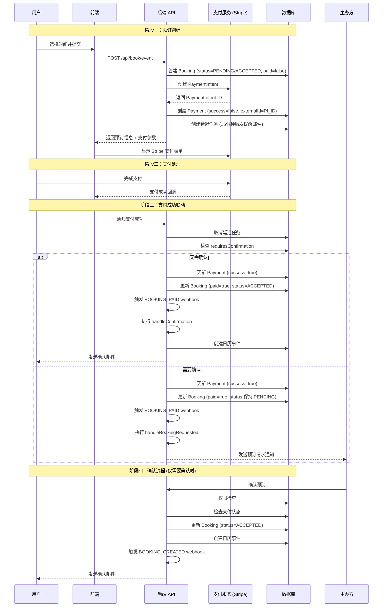

# 付费预约生命周期 (Paid Booking Lifecycle)

本文档详细描述了 Cal.diy 系统中付费预约从下单到确认的完整流程，以及支付状态与预约状态之间的联动机制。

---

## 1. 状态定义

### 1.1 预约状态 (BookingStatus)

定义于 `packages/prisma/schema.prisma:843`

```prisma
enum BookingStatus {
  CANCELLED     @map("cancelled")
  ACCEPTED      @map("accepted")
  REJECTED      @map("rejected")
  PENDING       @map("pending")
  AWAITING_HOST @map("awaiting_host")
}
```

| 状态 | 描述 |
|------|------|
| `PENDING` | 待处理，预订已创建但未确认 |
| `ACCEPTED` | 已接受/确认，预订已生效 |
| `REJECTED` | 已拒绝，预订被主办方拒绝 |
| `CANCELLED` | 已取消，预订被取消 |
| `AWAITING_HOST` | 等待主办方，需主办方确认 |

### 1.2 Booking 模型关键字段

定义于 `packages/prisma/schema.prisma:851`

| 字段 | 类型 | 说明 |
|------|------|------|
| `status` | BookingStatus | 预订状态，默认 `ACCEPTED` |
| `paid` | Boolean | 是否已支付，默认 `false` |
| `payment` | Payment[] | 关联的支付记录 |

### 1.3 支付状态 (Payment Model)

定义于 `packages/prisma/schema.prisma:1095`

```prisma
model Payment {
  id            Int            @id @default(autoincrement())
  uid           String         @unique
  bookingId     Int
  booking       Booking?       @relation(fields: [bookingId], references: [id], onDelete: Cascade)
  amount        Int
  fee           Int
  currency      String
  success       Boolean        # 支付是否成功
  refunded      Boolean        # 是否已退款
  externalId    String         @unique  # 第三方支付平台ID (如 Stripe PaymentIntent ID)
  paymentOption PaymentOption? @default(ON_BOOKING)
}

enum PaymentOption {
  ON_BOOKING  # 预订时立即支付
  HOLD        # 预授权，后续扣款
}
```

---

## 2. 完整流程

### 2.1 流程图概览

```
┌─────────────────┐     ┌─────────────────┐     ┌─────────────────┐
│   1. 预订创建    │────▶│   2. 支付处理    │────▶│  3. 支付成功联动 │
│  (Create Booking)│     │  (Payment Flow)  │     │ (Post-Payment)  │
└─────────────────┘     └─────────────────┘     └────────┬────────┘
                                                           │
                    ┌──────────────────────────────────────┘
                    ▼
           ┌─────────────────┐
           │  4. 确认流程     │
           │ (Confirmation)  │
           └─────────────────┘
```

### 2.2 阶段一：预订创建 (Booking Creation)

**入口文件**: `packages/features/bookings/lib/handleNewBooking/createBooking.ts`

#### 流程步骤：

1. **用户选择付费预约类型**
   - 事件类型 (EventType) 配置了价格 `price > 0`
   - 关联支付应用 (如 Stripe)

2. **构建预订数据** (`buildNewBookingData` 函数)
   ```typescript
   // packages/features/bookings/lib/handleNewBooking/createBooking.ts:183
   const newBookingData: Prisma.BookingCreateInput = {
     status: eventType.isConfirmedByDefault ? BookingStatus.ACCEPTED : BookingStatus.PENDING,
     paid: false,  // 初始为未支付
     // ... 其他字段
   };
   ```

   **关键点**: 初始状态取决于 `eventType.isConfirmedByDefault`
   - `true`: `status = ACCEPTED` (自动确认)
   - `false`: `status = PENDING` (待确认)

3. **创建支付记录** (StripePaymentService)
   
   **入口文件**: `packages/app-store/stripepayment/lib/PaymentService.ts:61`

   ```typescript
   // 创建 Stripe PaymentIntent
   const paymentIntent = await this.stripe.paymentIntents.create(params, {
     stripeAccount: this.credentials.stripe_user_id,
   });

   // 创建本地 Payment 记录
   const paymentData = await prisma.payment.create({
     data: {
       uid: uuidv4(),
       booking: { connect: { id: bookingId } },
       amount: payment.amount,
       currency: payment.currency,
       externalId: paymentIntent.id,  // Stripe PaymentIntent ID
       success: false,                 // 初始为未成功
       refunded: false,
       paymentOption: paymentOption || "ON_BOOKING",
       // ...
     },
   });
   ```

4. **创建等待支付邮件任务**
   
   **入口文件**: `packages/app-store/stripepayment/lib/PaymentService.ts:377`

   ```typescript
   // 创建延迟任务，15分钟后发送等待支付提醒邮件
   await tasker.create(
     "sendAwaitingPaymentEmail",
     { bookingId: booking.id, paymentId: paymentData.id },
     { scheduledAt: dayjs().add(15, "minutes").toDate(), referenceUid: booking.uid }
   );
   ```

#### 此阶段结束状态：
| 字段 | 值 |
|------|-----|
| `booking.status` | `ACCEPTED` 或 `PENDING` |
| `booking.paid` | `false` |
| `payment.success` | `false` |

---

### 2.3 阶段二：支付处理 (Payment Processing)

**支付方式**: Stripe (为主，也支持 PayPal 等)

#### 流程步骤：

1. **前端展示支付表单**
   - 文件: `packages/platform/atoms/event-types/payments/StripePaymentForm.tsx`
   - 用户输入支付信息

2. **Stripe 支付流程**
   - 创建 Checkout Session 或直接使用 PaymentIntent
   - 用户完成支付

3. **支付回调处理**
   
   **注意**: 社区版 Webhook 不可用
   ```typescript
   // apps/web/pages/api/integrations/stripepayment/webhook.ts
   export default function handler(_req: NextApiRequest, res: NextApiResponse) {
     res.status(404).json({ message: "Payment webhooks are not available in community edition" });
   }
   ```

---

### 2.4 阶段三：支付成功联动 (Post-Payment Success)

**核心处理函数**: `packages/app-store/_utils/payments/handlePaymentSuccess.ts`

这是支付状态与预约状态联动的**核心逻辑**。

#### 流程步骤：

1. **取消等待支付邮件任务**
   ```typescript
   // handlePaymentSuccess.ts:43
   await tasker.cancelWithReference(booking.uid, "sendAwaitingPaymentEmail");
   ```

2. **构建更新数据**
   ```typescript
   // handlePaymentSuccess.ts:54-57
   const bookingData: Prisma.BookingUpdateInput = {
     paid: true,                    // 标记为已支付
     status: BookingStatus.ACCEPTED, // 默认为已确认
   };
   ```

3. **检查是否需要确认**
   
   **关键逻辑**: 如果事件类型配置了 `requiresConfirmation`，则**不自动确认**
   ```typescript
   // handlePaymentSuccess.ts:82-91
   const requiresConfirmation = doesBookingRequireConfirmation({
     booking: { ...booking, eventType },
   });

   if (requiresConfirmation) {
     delete bookingData.status;  // 移除状态设置，保持原状态
   }
   ```

4. **事务更新支付和预订状态**
   ```typescript
   // handlePaymentSuccess.ts:92-115
   const paymentUpdate = prisma.payment.update({
     where: { id: paymentId },
     data: { success: true },  // 支付标记为成功
     select: { id: true, externalId: true },
   });

   const bookingUpdate = prisma.booking.update({
     where: { id: booking.id },
     data: bookingData,         // 更新 booking.paid 和 booking.status
     select: { status: true },
   });

   const [payment, updatedBooking] = await prisma.$transaction([paymentUpdate, bookingUpdate]);
   ```

5. **触发 BOOKING_PAID Webhook**
   ```typescript
   // handlePaymentSuccess.ts:160-186
   const subscriberMeetingPaid = await getWebhooks({
     userId,
     eventTypeId: booking.eventTypeId,
     triggerEvent: WebhookTriggerEvents.BOOKING_PAID,
     // ...
   });

   // 发送 webhook 通知
   await Promise.all(bookingPaidSubscribers);
   ```

6. **后续处理分支**

   **分支 A: 预订已确认 (isConfirmed)**
   ```typescript
   // handlePaymentSuccess.ts:191-212
   if (!isConfirmed) {
     if (!requiresConfirmation) {
       // 不需要确认 → 执行确认流程
       await handleConfirmation({ ..., paid: true });
     } else {
       // 需要确认 → 发送预订请求通知
       await handleBookingRequested({ evt, booking });
     }
   } else if (areEmailsEnabled) {
     // 已确认 → 发送邮件和短信
     await sendScheduledEmailsAndSMS({ ...evt }, ...);
   }
   ```

#### 状态联动总结：

| 场景 | booking.paid | booking.status | payment.success |
|------|-------------|----------------|-----------------|
| 支付成功 + 无需确认 | `true` | `ACCEPTED` | `true` |
| 支付成功 + 需要确认 | `true` | 保持原值 (PENDING) | `true` |

---

### 2.5 阶段四：确认流程 (Confirmation Flow)

**入口文件**: `packages/trpc/server/routers/viewer/bookings/confirm.handler.ts`

当 `requiresConfirmation = true` 时，需要主办方手动确认预订。

#### 流程步骤：

1. **权限检查**
   ```typescript
   // confirm.handler.ts:166-177
   const bookingAccessService = new BookingAccessService(prisma);
   const isUserAuthorizedToConfirmBooking = await bookingAccessService.doesUserIdHaveAccessToBooking({
     userId: ctx.user.id,
     bookingId: bookingId,
   });
   ```

2. **支付检查** (关键逻辑)
   ```typescript
   // confirm.handler.ts:185-197
   // 如果预订需要支付但未支付，不允许确认
   if (confirmed && booking.payment.length > 0 && !booking.paid) {
     await prisma.booking.update({
       where: { id: bookingId },
       data: { status: BookingStatus.ACCEPTED },
     });
     return { message: "Booking confirmed", status: BookingStatus.ACCEPTED };
   }
   ```

   **注意**: 这里有个特殊逻辑：如果有支付记录但未支付，确认时会直接设置状态为 ACCEPTED。

3. **执行确认**
   ```typescript
   // confirm.handler.ts:364-374
   await handleConfirmation({
     user: { ...user, credentials: allCredentials },
     evt,
     recurringEventId,
     prisma,
     bookingId,
     booking,
     paid: booking.paid,  // 传递支付状态
     // ...
   });
   ```

#### handleConfirmation 函数详情

**文件**: `packages/features/bookings/lib/handleConfirmation.ts`

```typescript
// handleConfirmation.ts:245-309
const updatedBooking = await prisma.booking.update({
  where: { id: bookingId },
  data: {
    status: BookingStatus.ACCEPTED,  // 状态设置为 ACCEPTED
    references: { create: scheduleResult.referencesToCreate },
    metadata: { ..., videoCallUrl: meetingUrl },
  },
  select: { ... },
});
```

**关键点**: `handleConfirmation` 中**没有**更新 `booking.paid` 字段，支付状态只在 `handlePaymentSuccess` 中更新。

---

## 3. 状态联动机制详解

### 3.1 状态转换图

```
                    ┌─────────────┐
                    │   预订创建    │
                    │ paid: false │
                    │ status: P/AC│
                    └──────┬──────┘
                           │
                           ▼
                    ┌─────────────┐
                    │   等待支付    │
                    │             │
                    │  15分钟超时  │────▶ 发送提醒邮件
                    └──────┬──────┘
                           │
              ┌────────────┼────────────┐
              │            │            │
              ▼            ▼            ▼
       ┌──────────┐ ┌──────────┐ ┌──────────┐
       │ 支付成功  │ │ 支付失败  │ │  用户取消  │
       │          │ │          │ │          │
       │success:T │ │success:F │ │          │
       │paid:T    │ │paid:F    │ │          │
       └────┬─────┘ └──────────┘ └──────────┘
            │
            ▼
    ┌───────────────┐
    │ requiresConf? │
    └───────┬───────┘
     YES    │    NO
            │
     ┌──────┴──────┐
     ▼             ▼
┌─────────┐  ┌─────────────┐
│ 待确认   │  │  自动确认    │
│status:P │  │status:ACCEPT│
│paid:T   │  │paid:T       │
└────┬────┘  └─────────────┘
     │
     ▼
┌─────────────┐
│ 主办方确认   │
│status:ACCEPT│
│paid:T       │
└─────────────┘
```

### 3.2 关键联动点

#### 联动点 1: 支付成功 → 预约已支付

**文件**: `packages/app-store/_utils/payments/handlePaymentSuccess.ts:54-115`

```typescript
const bookingData: Prisma.BookingUpdateInput = {
  paid: true,                    // 1. 标记为已支付
  status: BookingStatus.ACCEPTED, // 2. 尝试确认
};

// 如果需要确认，则不设置状态
if (requiresConfirmation) {
  delete bookingData.status;
}

// 事务更新
const [payment, updatedBooking] = await prisma.$transaction([
  prisma.payment.update({
    where: { id: paymentId },
    data: { success: true },  // 支付标记成功
  }),
  prisma.booking.update({
    where: { id: booking.id },
    data: bookingData,         // 更新预订
  }),
]);
```

#### 联动点 2: 确认时的支付检查

**文件**: `packages/trpc/server/routers/viewer/bookings/confirm.handler.ts:185-197`

```typescript
// 如果预订需要支付但未支付
if (confirmed && booking.payment.length > 0 && !booking.paid) {
  await prisma.booking.update({
    where: { id: bookingId },
    data: { status: BookingStatus.ACCEPTED },
  });
  return { message: "Booking confirmed", status: BookingStatus.ACCEPTED };
}
```

**注意**: 这段逻辑允许在未支付的情况下确认预订，这可能是一个特殊场景处理。

#### 联动点 3: 拒绝时的退款处理

**文件**: `packages/trpc/server/routers/viewer/bookings/confirm.handler.ts:413-419`

```typescript
// 拒绝预订时，如果有支付记录，处理退款
if (booking.payment.length) {
  await processPaymentRefund({
    booking: booking,
    teamId: booking.eventType?.teamId,
  });
}
```

---

## 4. 关键代码文件索引

| 功能 | 文件路径 | 说明 |
|------|---------|------|
| 预订创建 | `packages/features/bookings/lib/handleNewBooking/createBooking.ts` | 创建 Booking 记录 |
| 支付服务 | `packages/app-store/stripepayment/lib/PaymentService.ts` | Stripe 支付集成 |
| 支付成功处理 | `packages/app-store/_utils/payments/handlePaymentSuccess.ts` | **核心联动逻辑** |
| 预订确认 | `packages/trpc/server/routers/viewer/bookings/confirm.handler.ts` | 确认/拒绝预订 |
| 确认逻辑 | `packages/features/bookings/lib/handleConfirmation.ts` | 确认后的处理 |
| 数据库模型 | `packages/prisma/schema.prisma` | Booking, Payment 模型定义 |

---

## 5. 特殊场景

### 5.1 预授权支付 (HOLD)

当 `paymentOption = HOLD` 时：
- 不立即扣款，只收集支付方式
- `Payment.success = false`
- `Booking.paid = false`
- 后续通过 `chargeCard` 方法实际扣款

**代码**: `packages/app-store/stripepayment/lib/PaymentService.ts:148-225`

```typescript
async collectCard(...) {
  // 创建 SetupIntent，不扣款
  const setupIntent = await this.stripe.setupIntents.create(params, ...);
  
  // 创建 Payment 记录，success=false
  const paymentData = await prisma.payment.create({
    data: {
      ...,
      success: false,
      paymentOption: "HOLD",
    },
  });
}
```

### 5.2 重新预订 (Reschedule)

重新预订时会继承原预订的支付状态：

**代码**: `packages/features/bookings/lib/handleNewBooking/createBooking.ts:122-127`

```typescript
if (originalRescheduledBooking?.paid && originalRescheduledBooking?.payment) {
  const bookingPayment = originalRescheduledBooking.payment.find((payment) => payment.success);
  if (bookingPayment) {
    createBookingObj.data.payment = { connect: { id: bookingPayment.id } };
  }
}
```

### 5.3 座位预订 (Seats)

座位预订有特殊的支付逻辑，每个座位可能有独立的支付记录。

**文件**: `packages/features/bookings/lib/handleSeats/create/createNewSeat.ts`

---

## 6. 流程图 (Mermaid)



---

## 7. 总结

### 7.1 核心原则

1. **支付状态独立于预订状态**: `payment.success` 和 `booking.paid` 是两个独立字段，但通常同时更新
2. **双重确认机制**:
   - 支付确认 (`payment.success = true`)
   - 预订确认 (`booking.status = ACCEPTED`)
3. **灵活的确认策略**: 通过 `requiresConfirmation` 控制是否需要主办方手动确认

### 7.2 状态速查表

| 场景 | booking.status | booking.paid | payment.success |
|------|---------------|-------------|-----------------|
| 刚创建，自动确认 | ACCEPTED | false | false |
| 刚创建，需确认 | PENDING | false | false |
| 支付成功，无需确认 | ACCEPTED | true | true |
| 支付成功，需确认 | PENDING | true | true |
| 主办方确认后 | ACCEPTED | true | true |
| 已拒绝 | REJECTED | 视情况 | 视情况 |
| 已取消 | CANCELLED | 视情况 | 视情况 |

### 7.3 关键函数职责

| 函数 | 主要职责 |
|------|---------|
| `createBooking` | 创建预订记录，初始化状态 |
| `PaymentService.create` | 创建支付记录，集成第三方支付 |
| `handlePaymentSuccess` | **核心联动**: 更新支付和预订状态 |
| `confirmHandler` | 处理确认/拒绝请求 |
| `handleConfirmation` | 确认后的后续处理 (日历、邮件等) |
